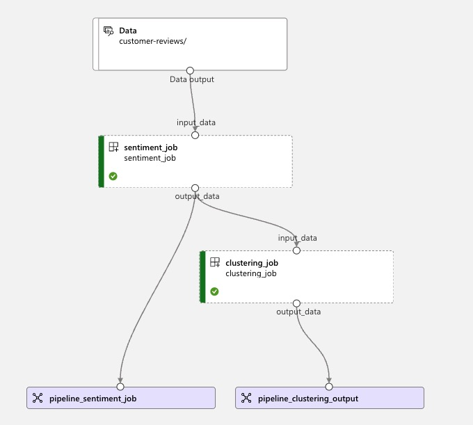
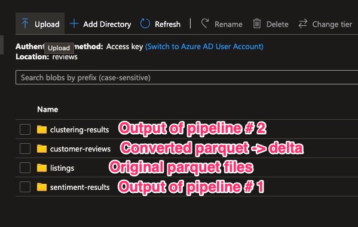

# adls-synapse-aml-operations
The goal of this repo is to highlight a workflow of using Azure Machine Learning to work with delta tables in
Azure Synapse. The major steps include:
1. Generating sample parquet files and loading them into a data lake.
2. Converting the parquet files to Delta tables using Azure Synapse.
3. Using these delta tables as input into an Azure ML pipeline that first generates sentiment on customer
   reviews (using Azure Cognitive Services for Language) and then uses that to cluster customers using a
   K-Means algorithm. The final completed pipeline in Azure Machine Learning should look like below:

Through the various stages above, various folders are created to track the stages. A quick visual on this is
shown below:

## Other Details
- This repo is intended just to surface functionality and is not "hardened" with good security and identity
  access practices.
- To illustrate Azure ML pipelines and Cognitive services, a text analytics resource was created to make API
  calls to categorize customer sentiment. However, with continuing integrations in Azure Synapse, an easier
  way is highlighted
  [here](https://learn.microsoft.com/en-us/azure/synapse-analytics/machine-learning/tutorial-cognitive-services-sentiment).
- Originally, sample files were generated as CSV files. However, when converting to delta tables, this raised
  issues despite first loading them into a dataframe before writing them in the delta format. Hence, generated
  the sample files in parquet.
- Customer reviews in the sample dataset were generated using ChatGPT.
- Future improvement of this repo could include "hardening" it to reinforce good cloud security and identity
  access practices (e.g. using Key Vault, VNET support) and parallelizing operations (for example, in calling
  the Cognitive Service API).
